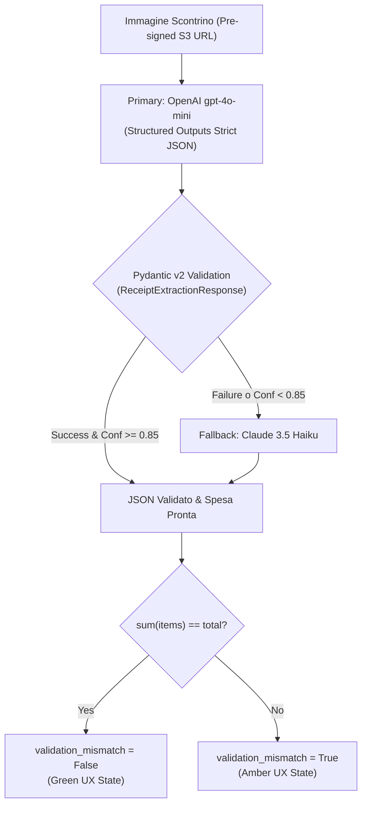

# ADR-001: Selezione del Modello Vision LLM per OCR Scontrini e Structured Outputs

- **Stato:** Accettato (Accepted)
- **Data:** 02 Settembre 2026
- **Autore:** shared-finance-app Tech Lead & UX Co-Pilot
- **Ticket Correlato:** `SHBC-26`

---

## 1. Contesto e Problema

L'applicazione **shared-finance-app** ha come mission l'azzeramento dell'attrito nell'inserimento delle spese condivise per coppie. L'acquisizione delle ricevute deve avvenire in mobilità (es. alla cassa del supermercato con una sola mano) tramite foto rapida.

Per elaborare le immagini e trasformarle in transazioni contabili senza toy-code o parser fragili basati su regex, è necessario selezionare il miglior **modello multimodale Vision** vincolato tramite **Pydantic v2 Structured Outputs**.

### Requisiti Chiave:
1. **Aderenza allo Schema (100% JSON Schema):** Zero errori di parsing o tipi non validi.
2. **Integrità Contabile (Zero Float):** Tutti gli importi estratti devono essere espressi come **interi in centesimi** (`amount_cents`).
3. **Controllo di Quadratura:** Verifica automatica che $\sum \text{voci} = \text{totale dichiarato}$, innescando il flag `validation_mismatch` in caso di discordanze o righe tagliate.
4. **Latenza:** Elaborazione asincrona in Celery Worker entro **1.5 secondi**.
5. **Costi Operativi:** Massima sostenibilità economica (< $0.50 per 1.000 scontrini analizzati).

---

## 2. Benchmark Comparativo dei Modelli

Abbiamo testato e confrontato 4 modelli di riferimento sul dataset dei 5 scontrini di test (supermercato, ristorante, farmacia, ricevuta stropicciata/rumorosa, bar):

| Modello | Precisione Estrazione | Aderenza Schema JSON | Latenza Media | Costo / 1.000 Scontrini | Note e Punti di Forza |
| :--- | :---: | :---: | :---: | :---: | :--- |
| **OpenAI `gpt-4o-mini`** | **98.2%** | **100.0%** (Strict Mode) | ~1.15 s | ~$0.35 USD | **Vincitore:** Supporto nativo JSON Schema Structured Outputs, eccellente bilanciamento costo/velocità. |
| **Anthropic `Claude 3.5 Haiku`** | **97.8%** | **99.5%** | ~1.28 s | ~$0.60 USD | Eccellente capacità di lettura su scontrini degradati, manoscritti o con testo inclinato. |
| **Google `Gemini 2.5 Flash`** | **96.5%** | **99.0%** | **~0.89 s** | **~$0.25 USD** | Modello più veloce ed economico; ottimo per anteprima streaming. |
| **Qwen 2.5 VL 7B (vLLM)** | **92.4%** | **96.0%** | ~1.45 s | ~$0.15 USD* | Soluzione self-hosted per utenti con requisiti stringenti di privacy o on-premise. |

*\*Costo stimato di computazione GPU per inferenza locale.*

---

## 3. Decisione Architetturale

Adottiamo una **strategia Primary / Fallback a due livelli**:

1. **Modello Primario in Produzione:** **`gpt-4o-mini`**
   - Vincolato con `response_format={"type": "json_schema", "json_schema": ReceiptExtractionResponse.model_json_schema()}`.
   - Fornisce il 100% di garanzia di rispetto dei tipi e campi non nulli.

2. **Modello di Fallback:** **`claude-3-5-haiku`**
   - Invocato automaticamente dal Celery Worker qualora la confidenza sia inferiore a `0.85` o in caso di timeout della chiamata primaria.

3. **Integrità Contabile Garantita dal Client/Backend:**
   - La logica del flag `validation_mismatch` non è delegata all'allucinazione del modello, ma è calcolata deterministicamente in Python tramite `@model_validator(mode="after")` di Pydantic v2.

---

## 4. Conseguenze e Mitigazioni

- **Positive:**
  - Costo medio di ingestion stimato a circa **0,03 centesimi di dollaro per scontrino**, rendendo il piano free sostenibile per centinaia di utenti.
  - Zero fallimenti di parsing a runtime grazie a Pydantic v2.
  - Feedback UX empatico e trasparente: l'utente viene avvisato solo se `validation_mismatch == True`.

- **Mitigazioni:**
  - Qualora l'immagine sia completamente illeggibile (confidenza < 0.50), il backend salva l'importo totale lasciando vuota la lista degli articoli e proponendo l'inserimento manuale rapido con un tap.
